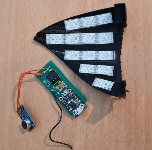
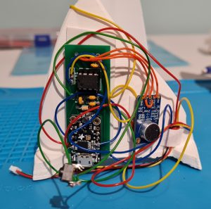
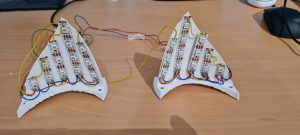
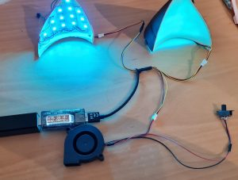

# Sound reactive cat ears

[Watch the video](https://github.com/kigyui/ledoutfits/raw/master/ledcatears/VID-20230426-WA0004.mp4)

I love LED sound reactive things. And by that I mean properly sound
reactive, not randomly flashing like a wedding DJ sound rig, but
reacting to the bass beat. I previously made a skirt that did this,
and a bag, and even updated a pair of cat ear headphones. For GFB I
wanted to make it more seamless by making attachable cat ears.

I’ve been using a hardware spectrum analyser in the past because it
just works great and doesn’t need any complex microprocessor to do
real time audio capture and FFT. To be fair these days the ESP32 is
more than capable of fast DMA audio capturing and FFT (WLED has some
interesting sound reactive code but it would need a little tweaking),
so it was just quicker just to use one of the boards I had previously
designed and had made and already built for the cat ear headphones and
just update my existing code.

 

The first step of the project was to design a suitable sized cat ear
in Fusion 360, this took much longer than imagined as that software
has a bit of a learning curve, especially when wanting to make more
organic shapes, fit over a curved kigu head, and have covers that clip
over the electronics. The final design has an inner part we can stick
the LEDs to and an outer cover with a 1cm air gap to give some
reasonable diffusion. (For even better diffusion, [wow_elec_tron](https://www.instagram.com/wow_elec_tron/) does
some amazing work on figuring out the best LED diffusion using 3d
printed channels).

I had some addressable LED strips left over and cut up to give 13 LEDs
per ear. Adding more LEDs, using 35mm ones instead of 50mm, would
give a better density and allow more fancy animations, but this was a
deliberate trade-off: in a dark environment you want the ears to be
noticable, but not so bright they are annoying to others. And I
wanted to make sure I could get at least 3 hours of run-time including
running a cooling fan for the mask from a small rechargable battery.
I use a good quality phone-bank style battery based internally on a
18650 cell to minimise the risk of issues having a rechargable battery
close to your head (I’ve had enough LIPO problems not to want those
anywhere near my head).

 

The final setup for GFB is shown above, with a small switched fan for
mask cooling. The battery power splits to the right ear which has all
the electronics, and the left ear which just has LEDs. A third
(yellow) wire links the two ears to pass on the control to the LEDs in
left ear. Threaded inserts allow the inside section to attach with M4
screws through holes in the mask, and the cables run through the wig.
A small switch pokes out the side of the right ear allowing mode
changes. The covers clip on and were painted to match brown hair.
Originally the plan was to glue the covers onto the inserts, but it’s
easier to attach the ears without the covers, and we can always change
the covers later to add furry ones or even latex ones. Finally a
small clip (not shown) was hot-glued into the mask to take the
battery.

The code is just updated version of the one used for the skirt (see
the code in this repo), with the switch allowing
cycling between off, a photo mode (which just slowly changes colours
without flashing), and several beat mode animations.
