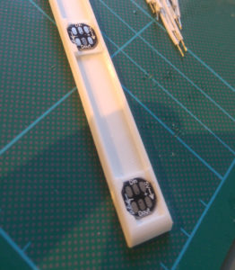
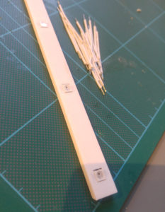
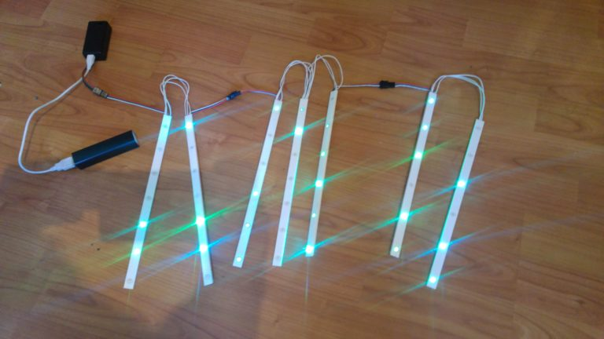
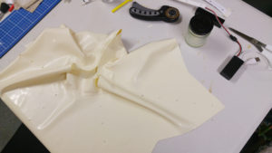
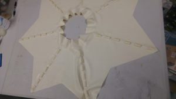
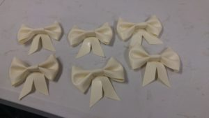

# Making the Magical Girl Layered LED Skirt

I’ve attached LED strips to leather before, by using the long strips
you can buy that have WS2812B fully-addressable RGB LEDs on them and
sticking them to the leather. But latex, being stretchy, posed some
new challenges.

After some experiments with strips I decided instead on making a 3D
printed tray and using individual LEDs. You can pick up 50 of the
LEDs very cheaply from Aliexpress or ebay. Using a tray adds some
rigidity which protects the wiring and helps the LEDs stand out around
the circle skirt, and also lets me position them wherever I like. It
makes the strips easier to take in and out of the skirt, and there is
still a tiny bit of flexibility along the length.

Since this is a skirt overlay to sit on top of another circle skirt, I
decided on a triangle pattern, with 7 triangles (making 7 strips),
with each strip being between 6 and 7 LEDs (somewhat randomly). If you
think of Madoka Magica that was the rough idea. This meant the strips
needed to be 275mm long, which also meant they could be printed in one
piece on a 3D Printer.

Using OpenSCAD for design after a few attempts I was able to print a
piece that a WS2812B single LED would snap into. Then I made a strip
with a bevelled edge so it can be easily threaded into the latex. Each
tray took a couple of hours print time in white PLA:

[Here is the OpenSCAD source code for the tray.](pixel.scad)

 

The 7 LED strips are wired in series, so the “data out” at the end of
the strip runs back up to the top and into the “data in” of the next
strip. This complicates the programming a little but saves having lots
of extra snaking data wires.

I hooked everything up with 26AWG silicone coated wire which was a
good compromise between size and ability to handle the current: If all
50 LEDs were set to white at the same time then the first power wires
would be carrying 3Amps, but the wires are short and the patterns
rarely have all LEDs on at the same time, and even less likely to all
be white, and my battery wouldn’t be able to handle that anyway.

The control box is powered by an ardunio-like microcontroller. I used
a DFRobot Beetle because I happened to have one around and they’re
small and cheap, but any Ardunio board would do. Hooked to the Beetle
is a MSEQ7 graphic equalizer IC connected to a sparkfun microphone
board with auto gain control.  Using a chip for the graphic equalizer
rather than coding it makes the programming so much easier.  Also
hooked to the Beetle is a HC-05 bluetooth (normal bluetooth, not LE)
module.

Power is provided by a small rechargable USB battery. I got this one
at a trade show so I’m not sure it’s capacity, but it easily can run
the controller and LEDs for many hours on a charge. The controller and
electronics were housed in a 9V battery case I had spare.

Knowing the length of the triangles for the skirt, and my waist size
(minus 10% for stretch) I drew up a pattern in Inkscape and used it to
cut out the latex. Because there are 7 triangles it didn’t separate
into sections well, so I just cut it complete out of a single piece
which also saved adding a seam. I added a 5cm waist band to the top.

[Here is the Inkscape file of the pattern I used.](skirtoverlay.svg)

After marking all the holes we punched them out, using a leather punch
over some hardwood. This was far more effort than it should have been
and I’ve since learnt that the “Prym” punch pliers work amazingly well
for making perfect small holes in latex.

 

Originally each LED tray was going to slide down into a complete latex
pocket, enclosed on all three sides, but this was a failure. It was
almost impossible to get the trays into and out of the pocket. The
idea is to be able to remove the electronics to add to different
skirts in the future, or to fix any issues, or just to allow the skirt
to get cleaned and shined.

What worked well was adding little strips of latex behind each of the
LEDs. This protects the underskirt from anything metal that might
cause a stain as well as pressing the LED against the front of the
skirt.

A few people have commented that I could reinforce the latex around
the holes using cotton tape then it won’t stretch, but I’ve found that
it really isn’t needed and if something does move and the hole doesn’t
quite align, the LED still shines quite well through the white latex.

A pocket was made to hold the battery and control box with a small
hole to not muffle the microphone too much and that pocket was
attached to the back of the skirt.

Adding a few bows and we’re done!

[Source code and patterns will be updated here](../src/ledskirt)

Since making the skirt I upgraded it removing the thick connectors and
wires between strips and replacing them with tiny JST connectors
instead. The patterns I use rarely have many of the LEDs on at once,
so thinner wire is just fine. I also added a button to change modes
as getting a phone out and connecting to the skirt takes too long for
a quick change.

I also cut the skirt down the back seam and added a zipper to save
having to stretch it over hips and undoing and reconnecting the
connectors when putting it on, this will help if having to take it on
and off like when getting a taxi or sitting down somewhere.

Project completed in July 2018
